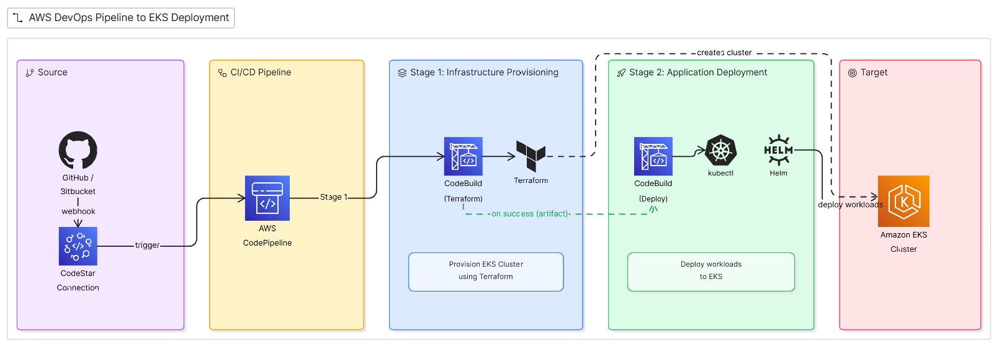

# 🚀 Terraform-Based AWS CodePipeline for EKS Deployment

## 📌 Overview

This repository provides a **modular Terraform-based infrastructure setup** to provision an AWS CodePipeline that automates the deployment of an **Amazon EKS (Elastic Kubernetes Service)** cluster and its workloads.

⚠️ Note:
This repository focuses **only on infrastructure provisioning**.
Build execution logic (buildspec files) is managed separately within CodeBuild configurations.

---

## 🧠 Architecture

### 🔹 High-Level Flow



---

## 📂 Repository Structure

```
.
├── main.tf                  # Root module
├── variables.tf
├── outputs.tf
├── terraform.auto.tfvars
│
├── modules/
│   ├── codepipeline/        # Pipeline definition
│   ├── codebuild/           # Build project configuration
│   ├── iam/                 # Roles & policies
│   ├── s3/                  # Remote state + artifacts
│   ├── kms/                 # Encryption setup
```

---

## ⚙️ What This Infrastructure Creates

After `terraform apply`, the following resources are provisioned:

* AWS CodePipeline (multi-stage pipeline)
* CodeBuild projects for execution
* IAM roles and policies
* S3 bucket for:

  * Terraform remote state
  * Pipeline artifacts
* KMS key for encryption
* CodeStar connection (optional for GitHub)

👉 This results in a **fully automated CI/CD pipeline for EKS deployments**.

---

## 🔁 Pipeline Strategy

### 🟢 Phase 1: EKS Cluster Provisioning

* Uses Terraform via CodeBuild
* Creates EKS cluster and base infrastructure

### 🔵 Phase 2: Application Deployment

* Uses kubectl / Helm via CodeBuild
* Deploys workloads into EKS cluster

---

## 🔌 Source Configuration

Supported source options:

### ✅ GitHub (via CodeStar Connection)

### ✅ Amazon S3 (artifact source)

👉 Controlled through Terraform variables.

---

## 🛠️ Prerequisites

* AWS CLI configured
* Terraform installed
* kubectl installed
* Required IAM permissions

---

## 🚀 Deployment (Copy & Run)

### Clone Repository

```
git clone https://github.com/chinnayyachintha/codepipeline.git
cd codepipeline
```

---

### Initialize Terraform

```
terraform init
```

---

### Validate

```
terraform validate
```

---

### Plan

```
terraform plan
```

---

### Apply

```
terraform apply -auto-approve
```

---

## 📌 Configuration (terraform.auto.tfvars)

Example:

```
region        = "us-east-1"
project_name  = "eks-pipeline"
source_type   = "github"   # or "s3"
repository    = "your-repo"
branch        = "main"
```

---

## 📊 After Deployment

Once applied:

1. Navigate to AWS Console
2. Open CodePipeline
3. Observe pipeline stages:

   * Phase 1 → EKS Cluster Creation
   * Phase 2 → Application Deployment

👉 The pipeline will:

* Pull source code
* Execute infrastructure provisioning
* Deploy workloads to EKS

---

## 🔐 Security

* IAM least privilege model
* KMS encryption enabled
* Secure S3 backend
* No hardcoded secrets

---

## 🎯 Key Highlights

* Modular Terraform architecture
* Two-stage CI/CD pipeline
* Supports GitHub & S3 sources
* Fully automated EKS deployment
* Production-ready design

---

## 🤝 Contribution

Feel free to fork and enhance.

---

## ⭐ Support

If you find this useful, give it a star ⭐
